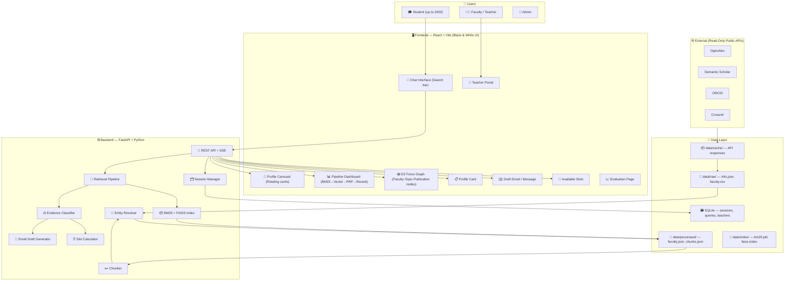
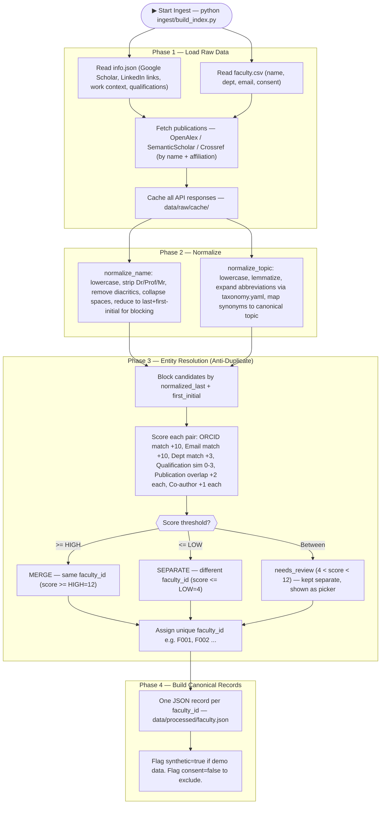
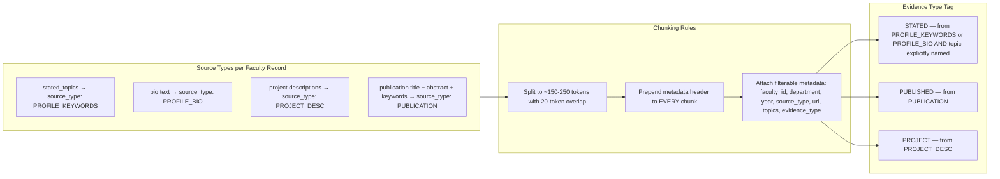
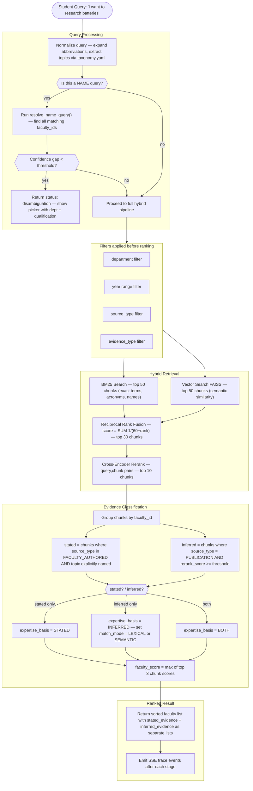
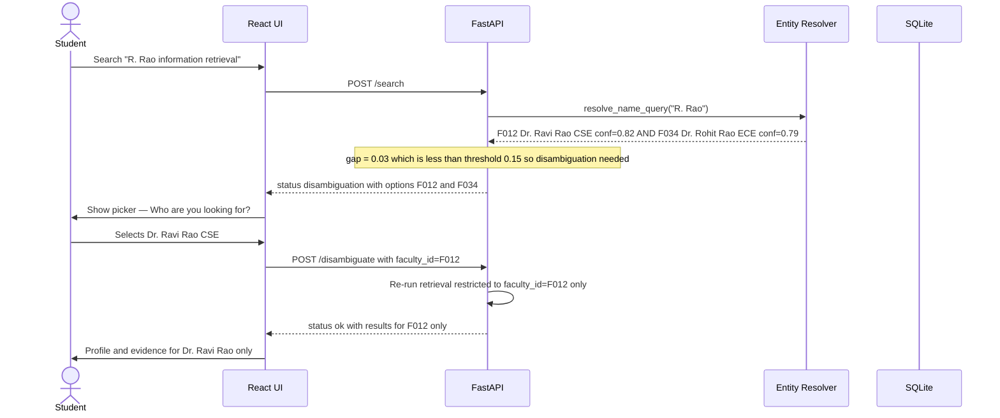
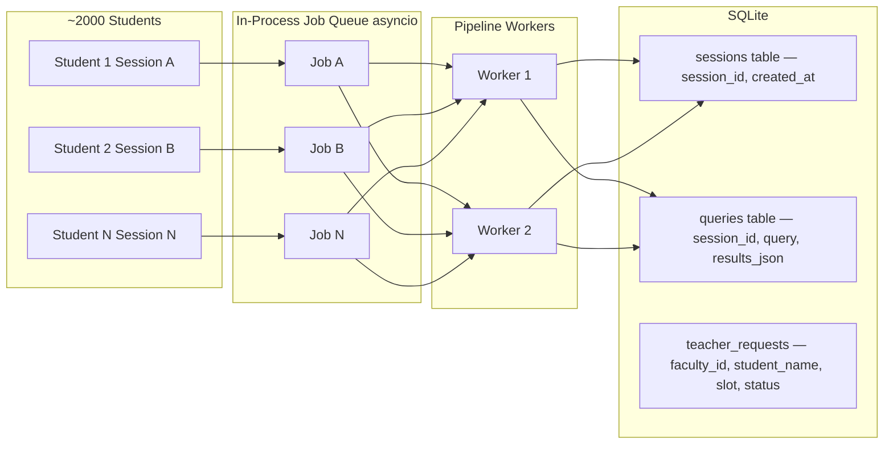

# ARCHITECTURE.md — Faculty Research Discovery Assistant
## Team ERROR 404 | JIG26_23 | Track C — NLP, LLM & RAG

> **How to read this file**: Start with the System Overview (Section 1), then follow each section in order. Every box in the flowcharts maps to a real file in the repo layout (Section 10).

---

## 1. System Overview



---

## 2. Data Ingestion & Entity Resolution Flow

> This runs **once** (or nightly) to build the corpus. Never chunk before this step.



---

## 3. Chunking Strategy

> Every piece of text gets a **metadata header prepended** before embedding or BM25 indexing.



### 3.1 Metadata Header Format (prepended to every chunk before indexing)

```
[Faculty: Dr. Ravi Rao | ID: F012 | Dept: CSE | Source: PUBLICATION | Year: 2023 | Topics: nlp, information retrieval]
<passage text here>
```

### 3.2 Chunk JSON Schema

```json
{
  "chunk_id":      "F012-PUB-003-0",
  "faculty_id":    "F012",
  "source_type":   "PUBLICATION",
  "evidence_type": "PUBLISHED",
  "text": "[Faculty: Dr. Ravi Rao | ID: F012 | Dept: CSE | Source: PUBLICATION | Year: 2023 | Topics: nlp, retrieval]\nIn this paper we propose a transformer-based approach ...",
  "raw_text":   "In this paper we propose a transformer-based approach ...",
  "department": "CSE",
  "year":       2023,
  "topics":     ["natural language processing", "information retrieval"],
  "url":        "https://doi.org/10.xxxx/xxxxx",
  "pub_id":     "P003",
  "project_id": null
}
```

---

## 4. Canonical Faculty Record JSON Schema (from info.json)

```json
{
  "faculty_id":    "F012",
  "display_name":  "Dr. Ravi Rao",
  "name_variants": ["R. Rao", "Ravi K. Rao", "R. K. Rao"],
  "department":    "CSE",
  "qualification": "PhD, IIT Madras",
  "email":         "ravi.rao@college.edu",
  "orcid":         "0000-0002-1234-5678",
  "linkedin_url":  "https://linkedin.com/in/ravirao",
  "scholar_url":   "https://scholar.google.com/citations?user=xxxx",
  "photo_url":     null,
  "consent":       true,
  "synthetic":     false,
  "stated_topics": ["natural language processing", "information retrieval"],
  "bio":           "Dr. Rao's research focuses on NLP and IR for legal documents ...",
  "publications": [
    {
      "pub_id":   "P003",
      "title":    "Transformer-Based Passage Retrieval for Legal Text",
      "year":     2023,
      "venue":    "ACL 2023",
      "abstract": "In this paper we propose ...",
      "keywords": ["transformer", "passage retrieval", "legal NLP"],
      "url":      "https://doi.org/10.xxxx/xxxxx",
      "authors":  ["Ravi Rao", "S. Kumar"]
    }
  ],
  "projects": [
    {
      "project_id":  "J1",
      "title":       "AI for Legal Document Search",
      "description": "Developing NLP tools for searching legal judgements ...",
      "year":        2024,
      "funding":     "DST"
    }
  ],
  "timetable": [
    {"day": "Mon", "start": "10:00", "end": "11:00", "type": "class", "room": "A101"},
    {"day": "Wed", "start": "14:00", "end": "15:00", "type": "class", "room": "B202"}
  ],
  "availability_override": null
}
```

---

## 5. Retrieval Pipeline — Full Flow



---

## 6. Duplicate Name Handling (Q-DUP Scenario)



---

## 7. UI Layout Wireframes (Black & White)

### 7.1 Student Chat Interface

```
+--------------------------------------------------------------------------+
|  Faculty Research Discovery Assistant          [Session: STU-4421]       |
|  ======================================================================  |
|                                                                          |
|  [Chat History]                                                          |
|  +--------------------------------------------------------------------+  |
|  |  BOT: Hello! Search for faculty by research topic or name.         |  |
|  |       Examples: "batteries", "cybersecurity", "Dr. Rao", "NLP"    |  |
|  |                                                                    |  |
|  |  YOU: I want to do research on battery technology                  |  |
|  |                                                                    |  |
|  |  BOT: Searching... [####.......] BM25 -> Vector -> RRF -> Rerank  |  |
|  |       Found 4 faculty members. Showing results below              |  |
|  +--------------------------------------------------------------------+  |
|                                                                          |
|  Filters: [Dept: All v]  [Year: 2020-2025]  [Source: All v]            |
|                                                                          |
|  [  Search: Type your research interest or faculty name...  ] [Search]  |
+--------------------------------------------------------------------------+
```

### 7.2 Profile Carousel (Rotating Faculty Cards)

```
+--------------------------------------------------------------------------+
|  RESULTS  <- [1 of 4] ->         [Stated Expertise] [Inferred] [Both]  |
|  ======================================================================  |
|                                                                          |
|  +----------------------------------------------------------------------+|
|  |  [STATED]                                          Score: 0.92      ||
|  |  [Photo]  Dr. Anitha Krishnamurthy     Dept: EEE                   ||
|  |           PhD, IIT Bombay                                           ||
|  |           anitha.k@college.edu                                      ||
|  |           [ORCID] [Scholar] [LinkedIn]                              ||
|  |                                                                      ||
|  |  STATED EXPERTISE:                                                   ||
|  |    Source: Research Interests (Profile)                              ||
|  |    "battery management systems, electrochemical storage, EV power"   ||
|  |                                                                      ||
|  |  INFERRED FROM PUBLICATIONS:                                         ||
|  |    WARNING: Based on publication similarity, not stated by faculty   ||
|  |    "Lithium-ion capacity degradation modeling" (2022)               ||
|  |    LEXICAL match · score: 0.74 · [View Paper]                       ||
|  |                                                                      ||
|  |  Free Slots: Mon 2-3pm | Wed 4-5pm | Fri 11am-12pm                 ||
|  |                                                                      ||
|  |  [Draft Email]   [Copy Email]   [Open in Mail]                     ||
|  +----------------------------------------------------------------------+|
|                                                                          |
|  [o] [ ] [ ] [ ]      Auto-rotate: ON                                   |
+--------------------------------------------------------------------------+
```

### 7.3 Pipeline Dashboard (Live Trace via SSE)

```
+--------------------------------------------------------------------------+
|  RETRIEVAL PIPELINE                           Query: "battery tech"      |
|  ======================================================================  |
|                                                                          |
|  +----------+    +----------+    +----------+    +----------+           |
|  |  BM25    | -> |  VECTOR  | -> |   RRF    | -> | RERANK   |          |
|  |  Done    |    |  Done    |    |  Done    |    | Running  |          |
|  |  50 hits |    |  50 hits |    |  30 hits |    |  top 10  |          |
|  |  142ms   |    |  238ms   |    |  12ms    |    |          |          |
|  +----------+    +----------+    +----------+    +----------+           |
|                                                                          |
|  Rank changes:                                                           |
|  Dr. Krishnamurthy  #3 -> #2 -> #1 -> #1  UP                           |
|  Dr. Patel          #1 -> #1 -> #2 -> #3  DOWN                         |
|  Dr. Singh          #8 -> #5 -> #3 -> #2  UP                           |
+--------------------------------------------------------------------------+
```

### 7.4 Teacher Portal

```
+--------------------------------------------------------------------------+
|  FACULTY PORTAL                   Dr. Anitha Krishnamurthy · EEE        |
|  ======================================================================  |
|                                                                          |
|  My Research Interests (Stated)      My Timetable                       |
|  +-----------------------------+    +--------------------------------+   |
|  |  [x] battery management    |    | Mon  10-11am  EE301 (Lab)     |   |
|  |  [x] electrochemical stor. |    | Tue  2-4pm    A102            |   |
|  |  [x] EV power systems      |    | Thu  9-10am   B201            |   |
|  |  [+ Add topic]             |    | [+ Add class]                 |   |
|  +-----------------------------+    +--------------------------------+   |
|                                                                          |
|  Student Meeting Requests (3 pending)                                    |
|  +----------------------------------------------------------------------+|
|  |  Rahul Sharma   Topic: Li-ion batteries   Slot: Mon 2-3pm           ||
|  |  "I read your paper on capacity degradation..."  [Accept] [Deny]    ||
|  |                                                                      ||
|  |  Priya Nair     Topic: EV charging         Slot: Wed 4-5pm          ||
|  |  "I am interested in your EV research..."  [Accept] [Deny]          ||
|  +----------------------------------------------------------------------+|
|                                                                          |
|  [View how students find me]  [Edit Profile]  [Logout]                  |
+--------------------------------------------------------------------------+
```

---

## 8. API Endpoints Contract

```
POST  /search
      body:    {session_id, query, filters: {department, year_from, year_to, source_type, evidence_type}}
      returns: {status: "ok", trace_id, results: [Result]}
            or {status: "disambiguation", options: [{faculty_id, display_name, department, qualification, research_summary, orcid}]}

POST  /disambiguate
      body:    {session_id, query, faculty_id}
      returns: same as /search result, restricted to that faculty_id

GET   /trace/{trace_id}
      -> Server-Sent Events
         {stage: "bm25|vector|rrf|rerank|final", items: [{faculty_id, chunk_id, rank, score}], ms}
         700ms delay between events (configurable)

GET   /faculty/{faculty_id}
      -> full canonical record + aggregated evidence

GET   /slots/{faculty_id}
      -> [{day, start, end}]  next 5 free gaps >= 30 min
         or {"available": false, "reason": "Schedule not available"}

POST  /draft-email
      body:    {faculty_id, student_name, student_email, topic, evidence_id, slot_ids}
      returns: {subject, body, mailto}
               STATED  -> "I am interested in your work on X"
               INFERRED -> "I read your paper on X and would like to discuss..."

POST  /teacher/login
      body:    {email, password}
      returns: {token, faculty_id, display_name}

GET   /teacher/requests/{faculty_id}
      -> [{request_id, student_name, topic, slot, message, status}]

POST  /teacher/request/{request_id}/respond
      body:    {accept: true/false, message}
      returns: {ok: true}

POST  /teacher/timetable/{faculty_id}
      body:    {timetable: [{day, start, end, type, room}]}
      returns: {ok: true}

GET   /session/{session_id}
      -> history of queries and results for this session

GET   /health
      -> {"ok": true, "synthetic_data": true/false}
```

---

## 9. Email Draft Logic

### For STATED or BOTH expertise_basis:
```
Subject: Research Inquiry — [TOPIC]

Dear Dr. [NAME],

I am [STUDENT_NAME], a student at [COLLEGE].
I am interested in pursuing research on [TOPIC],
and your stated expertise in this area caught my attention.

[CITED_PASSAGE from PROFILE or PROJECT]

I would appreciate the opportunity to meet with you.
Proposed slots:
• [SLOT_1]
• [SLOT_2]

Thank you,
[STUDENT_NAME] | [EMAIL]
```

### For INFERRED expertise_basis:
```
Subject: Query Regarding Your Paper — [PAPER_TITLE]

Dear Dr. [NAME],

I am [STUDENT_NAME], a student at [COLLEGE].
I read your paper "[PAPER_TITLE]" ([YEAR]) and found it
highly relevant to my research interest in [TOPIC].
I would like to discuss related research directions.

Proposed slots:
• [SLOT_1]
• [SLOT_2]

Thank you,
[STUDENT_NAME] | [EMAIL]

NOTE: This email is based on publication similarity and does not
imply stated expertise by the faculty member.
```

---

## 10. Repository Layout

```
e:\hack-kmec\
|
+-- CONTEXT.md              <- Problem definition and hard rules
+-- PLAN.md                 <- Milestone checklist
+-- IMPLEMENTATION_PLAN.md  <- Detailed agent brief
+-- ARCHITECTURE.md         <- THIS FILE
+-- EVALUATOR_QA.md         <- Q&A for demo day
+-- WRITTEN_DISCUSSION.md   <- Why stated != inferred (fill after eval)
|
+-- config.yaml             <- All thresholds, delays, model names
|
+-- data/
|   +-- raw/
|   |   +-- info.json           <- YOUR INPUT FILE (Google Scholar, LinkedIn, work context)
|   |   +-- faculty.csv         <- name, dept, email, consent, orcid
|   |   +-- cache/              <- OpenAlex / SemanticScholar API cache
|   +-- processed/
|   |   +-- faculty.json        <- Canonical records (one per faculty_id)
|   |   +-- chunks.json         <- All headed chunks
|   |   +-- index/
|   |       +-- bm25.pkl        <- BM25 index
|   |       +-- faiss.index     <- Vector index
|   +-- taxonomy.yaml           <- Abbreviation expansions + synonym map
|
+-- ingest/
|   +-- sources.py              <- OpenAlex / SemanticScholar / Crossref fetch
|   +-- normalize.py            <- normalize_name(), normalize_topic()
|   +-- entity_resolution.py    <- Blocking, pair scoring, merge/separate
|   +-- canonical.py            <- Build one record per faculty_id
|   +-- chunk.py                <- Passage chunker with metadata header
|   +-- build_index.py          <- BM25 + FAISS build (one command)
|
+-- retrieval/
|   +-- bm25.py                 <- top-50 BM25
|   +-- vector.py               <- top-50 FAISS
|   +-- rrf.py                  <- Reciprocal Rank Fusion -> top 30
|   +-- rerank.py               <- Cross-encoder -> top 10
|   +-- evidence.py             <- build_basis(), names_topic(), match_mode
|   +-- pipeline.py             <- Orchestrate all stages, emit trace
|
+-- api/
|   +-- main.py                 <- FastAPI app, all routes
|   +-- schemas.py              <- Pydantic models for all requests/responses
|   +-- sessions.py             <- SQLite session store + job queue
|   +-- slots.py                <- Free slot calculator
|   +-- email_draft.py          <- Template + mailto: generator
|   +-- teacher.py              <- Teacher login, requests, timetable routes
|
+-- web/                        <- React + Vite frontend
|   +-- src/
|   |   +-- App.jsx
|   |   +-- components/
|   |       +-- ChatInterface.jsx
|   |       +-- ProfileCarousel.jsx
|   |       +-- PipelineDashboard.jsx
|   |       +-- D3Graph.jsx
|   |       +-- DisambiguationPicker.jsx
|   |       +-- ProfileCard.jsx
|   |       +-- EmailDraft.jsx
|   |       +-- SlotPicker.jsx
|   |       +-- TeacherPortal.jsx
|   |       +-- EvaluationPage.jsx
|   +-- index.css               <- Black & white design system
|   +-- package.json
|
+-- eval/
|   +-- queries.json              <- 10 queries (9 topic + Q-DUP)
|   +-- judgments.json            <- Relevance labels 0-3 per query
|   +-- duplicates_truth.json     <- Ground truth for duplicate pairs
|   +-- run_eval.py               <- Compute P@5, R@10, MRR, nDCG@10
|   +-- results.md                <- FILL after eval run
|   +-- basis_report.md           <- FILL after eval run
|   +-- disambiguation_report.md  <- FILL after Q-DUP run
|
+-- tests/
|   +-- test_normalize.py
|   +-- test_entity_resolution.py
|   +-- test_chunk.py
|   +-- test_pipeline.py
|   +-- test_evidence.py
|   +-- test_slots.py
|   +-- test_sessions.py
|
+-- scripts/
|   +-- ingest.sh
|   +-- serve.sh
|   +-- eval.sh
|   +-- demo.sh
|
+-- requirements.txt
+-- Makefile
+-- .gitignore
```

---

## 11. config.yaml — All Tunable Values

```yaml
models:
  embedder:  "all-MiniLM-L6-v2"
  reranker:  "cross-encoder/ms-marco-MiniLM-L-6-v2"

retrieval:
  bm25_top_k:        50
  vector_top_k:      50
  rrf_k:             60
  rrf_top_n:         30
  rerank_top_n:      10
  rerank_threshold:  0.0

entity_resolution:
  high_threshold:        12
  low_threshold:          4
  disambiguation_gap:  0.15
  weights:
    orcid_match:         10
    email_match:         10
    department_match:     3
    qualification_sim:    3
    publication_overlap:  2
    coauthor_overlap:     1

chunking:
  min_tokens:  150
  max_tokens:  250
  overlap:      20

slots:
  working_start:  "09:00"
  working_end:    "17:00"
  min_gap_min:    30
  next_n_slots:    5

trace:
  stage_delay_ms: 700

api:
  contact_email: "team14.jig26@college.edu"
  rate_limit_per_min: 30

session:
  max_concurrent_queries: 50
  result_ttl_hours: 24

teacher:
  session_expiry_hours: 8
```

---

## 12. Session & Multi-Student Architecture (~2000 Students)



- Each browser tab gets a `session_id` stored in `localStorage`
- Results are persisted in SQLite so students can close and return
- `asyncio.Queue` ensures the pipeline is not overloaded
- Teacher login issues a JWT token; teacher routes require it

---

## 13. Taxonomy File (data/taxonomy.yaml)

```yaml
abbreviations:
  NLP:  "natural language processing"
  ML:   "machine learning"
  LLM:  "large language model"
  CV:   "computer vision"
  IR:   "information retrieval"
  DL:   "deep learning"
  RL:   "reinforcement learning"
  IOT:  "internet of things"
  EV:   "electric vehicle"
  HCI:  "human computer interaction"

synonyms:
  "natural language processing": ["text mining", "computational linguistics", "NLU", "NLG"]
  "machine learning": ["statistical learning", "supervised learning", "ML models"]
  "cybersecurity": ["cyber security", "information security", "network security", "infosec"]
  "battery technology": ["electrochemical storage", "lithium ion", "energy storage", "li-ion"]
  "computer vision": ["image processing", "object detection", "image recognition"]
  "deep learning": ["neural network", "deep neural network", "DNN", "CNN", "RNN"]
  "internet of things": ["IoT", "smart devices", "embedded systems", "sensor networks"]

canonical_topics:
  - "natural language processing"
  - "machine learning"
  - "deep learning"
  - "computer vision"
  - "information retrieval"
  - "cybersecurity"
  - "battery technology"
  - "reinforcement learning"
  - "internet of things"
  - "bioinformatics"
  - "robotics"
  - "data mining"
  - "cloud computing"
  - "human computer interaction"
  - "smart agriculture"
  - "medical imaging"
  - "federated learning"
  - "graph neural networks"
```

---

## 14. Evaluation Query Set (10 queries)

| ID    | Query                                                         | Type        | Duplicate? |
|-------|---------------------------------------------------------------|-------------|------------|
| Q01   | faculty working on natural language processing for legal text | topic        | —         |
| Q02   | battery technology and energy storage research                | topic        | —         |
| Q03   | cybersecurity and network intrusion detection                 | topic        | —         |
| Q04   | who published on graph neural networks in 2022 or 2023       | pub + year   | —         |
| Q05   | projects on smart agriculture and IoT sensors                | project      | —         |
| Q06   | machine learning faculty in CSE department                   | filtered     | —         |
| Q07   | I need a guide for a thesis on medical image segmentation    | NL need      | —         |
| Q08   | faculty similar to Dr. [NAME]                                | similar      | —         |
| Q09   | deep learning and computer vision                            | topic        | —         |
| Q-DUP | R. Rao information retrieval                                 | name + topic | YES        |

---

## 15. Definition of Done Checklist

- [ ] info.json is loaded and all records pass schema validation
- [ ] Entity resolution assigns unique faculty_id; zero merge errors on duplicates_truth.json
- [ ] Every chunk has a metadata header with faculty_id, source_type, year, topics
- [ ] pipeline.search() returns expertise_basis and two separate evidence lists per faculty
- [ ] Q-DUP triggers a disambiguation picker; after choice, only that person's evidence appears
- [ ] All API endpoints respond correctly to curl
- [ ] SSE trace emits 5 events with ~700ms gaps
- [ ] Teacher can log in, view requests, manage timetable
- [ ] Email draft for INFERRED never claims expertise, refers to the paper only
- [ ] eval/results.md, eval/basis_report.md, eval/disambiguation_report.md filled from real run
- [ ] UI footer shows synthetic data warning when any record has synthetic=true
- [ ] make demo works from a clean checkout with no manual steps
- [ ] 3 browser windows can search concurrently without session cross-contamination
- [ ] App works fully offline once data is cached
