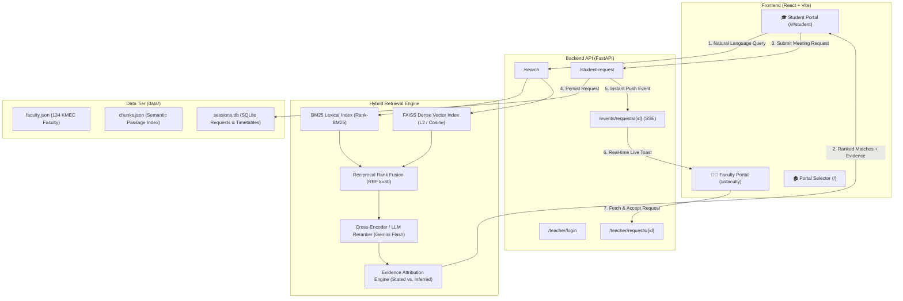

<p align="center">
  
</p>

<h1 align="center">🧭 SAARTHI (सारथी)</h1>

<p align="center">
  <strong>Intelligent Faculty Research Discovery & Direct Mentorship Platform</strong><br>
  <em>Built for Keshav Memorial Engineering College (KMEC), Hyderabad</em>
</p>

<p align="center">
  
  
  
  
  
  
  
  
</p>

---

## 📑 Table of Contents

- [Executive Summary](#-executive-summary)
- [System Architecture](#-system-architecture)
- [Key Features](#-key-features)
- [Portal URLs & Real-Time Sync](#-portal-urls--real-time-sync)
- [Test Faculty Credentials](#-test-faculty-credentials)
- [Directory & File Organization](#-directory--file-organization)
- [Quickstart Guide](#-quickstart-guide)
- [API Reference](#-api-reference)
- [Evaluation & Benchmark Results](#-evaluation--benchmark-results)
- [Why RAG vs. Fine-Tuning / LoRA](#-why-rag-vs-fine-tuning--lora)
- [Contributing & License](#-contributing--license)

---

## 🌟 Executive Summary

At higher education institutions like **Keshav Memorial Engineering College (KMEC)**, undergraduate students often struggle to find faculty mentors aligned with their specific project ideas (e.g. *homomorphic encryption, IoT edge consensus, distributed query optimization*). Traditional department directories are static, lack semantic search, and do not connect research expertise with real publications or booking slots.

**SAARTHI** is an enterprise-grade AI mentorship discovery engine that bridges this gap:
1. **Semantic Hybrid Search**: Combines BM25 lexical precision with FAISS dense vector search (`all-MiniLM-L6-v2`) and LLM reranking (Gemini / Groq) to find faculty even when queries don't match exact resume keywords.
2. **Dual Evidence Attribution**: Clearly distinguishes whether a faculty member's expertise is **STATED** (explicitly in their department curriculum bio) or **INFERRED** (deduced from verified peer-reviewed publications).
3. **Synchronous Direct Request System**: Students authenticate with their university Roll Number and can submit project mentorship requests directly to faculty with zero friction.
4. **Live Faculty Portal**: Teachers log into dedicated dashboards featuring **Server-Sent Events (SSE)** push notifications, real-time request acceptance/rejection, and customizable calendar slots.

---

## 🏛 System Architecture

SAARTHI uses a multi-stage retrieval-augmented generation (RAG) architecture with reciprocal rank fusion:



---

## 🚀 Key Features

### 1. 🎓 Student Discovery Assistant
- **Roll Number Authentication**: Validates university 12-digit roll numbers (e.g. `245324733083`) with department auto-detection.
- **Natural Language Topic Search**: Search for research areas such as *"cloud microservices", "blockchain cybersecurity", "deep learning computer vision"*.
- **Name Disambiguation**: When multiple professors share common names, SAARTHI automatically presents a disambiguation card with qualifications and departments.
- **Evidence Breakdown**: Each card highlights exact bio excerpts (**Stated**) or peer-reviewed paper titles (**Inferred**).
- **One-Click Pre-filled Request**: Includes meeting slots, topic chips, and pre-formatted interest notes.

### 2. 👨‍🏫 Faculty Member Portal
- **Direct Independent URL**: Accessible at `http://localhost:5173/#/faculty`.
- **Zero-Block Authentication**: One-click test logins plus dropdown access to all 134 KMEC faculty profiles.
- **Real-Time Synchronous Alerts**: Built with **Server-Sent Events (SSE)**; as soon as a student sends a request, a push notification appears on the teacher's screen without needing a page refresh.
- **Status Lifecycle**: Faculty can **Accept** or **Decline** requests, sending instant confirmation back to the student.
- **Weekly Timetable & Office Hours Manager**: Define classes, labs, and open office hour slots for student visits.

### 3. 🛡️ Anti-Spam & Reliability
- **Client & Server Rate Limiting**: Anti-spam limits student requests to **10 per faculty per 24 hours**, preventing request bombing while allowing smooth demo testing.
- **Automatic Fallback Mechanism**: If LLM reranking encounters rate limits or offline conditions, the engine automatically falls back to RRF vector-lexical rank order.

---

## 🌐 Portal URLs & Real-Time Sync

| Portal | URL | Purpose |
| :--- | :--- | :--- |
| **Portal Hub** | [`http://localhost:5173/`](http://localhost:5173/) | Role selector (Student vs. Faculty member) |
| **Student Portal** | [`http://localhost:5173/#/student`](http://localhost:5173/#/student) | Research query chat, faculty search, slot discovery |
| **Faculty Portal** | [`http://localhost:5173/#/faculty`](http://localhost:5173/#/faculty) | Dashboard, requests inbox, timetable manager |
| **Evaluation Portal**| [`http://localhost:5173/#/eval`](http://localhost:5173/#/eval) | Benchmarking metrics (Precision, MRR, Disambiguation) |

---

## 🎭 Test Faculty Credentials

Use any of these pre-seeded accounts to test student requests and faculty dashboards:

| Faculty ID | Faculty Member | Department & Domain | Test Email | Password |
| :--- | :--- | :--- | :--- | :--- |
| `FAC-1-2` | **Dr. P. Balakrishna** | CSE · Big Data Analytics & Database Systems | `teacher1@kmec.edu.in` | `teacher1` |
| `FAC-1-1` | **Dr. Ch. Rathan Kumar** | CSE (HOD) · Cloud Computing & Distributed Systems | `teacher2@kmec.edu.in` | `teacher2` |
| `FAC-1-29` | **Mrs. Madhavi Anisetty** | CSE · Cloud Systems & Virtualization | `teacher3@kmec.edu.in` | `teacher3` |
| `FAC-1-4` | **Dr. Aparna Rajesh Atmakuri** | CSE · Cybersecurity & Cryptographic Systems | `teacher4@kmec.edu.in` | `teacher4` |
| `FAC-2-4` | **Dr. Madhavi** | CSE-AIML · Artificial Intelligence & Machine Learning | `teacher5@kmec.edu.in` | `teacher5` |

*(Note: The Faculty Portal also contains a dropdown to switch to or test any of the 134 KMEC faculty members).*

---

## 📂 Directory & File Organization

The project is structured with clean separation between the API, retrieval pipeline, ingestion tools, evaluation suite, and frontend client:

```text
hack-kmec/
├── api/                             # FastAPI Backend Service
│   ├── main.py                      # REST endpoints, SSE push streams, CORS, startup
│   ├── schemas.py                   # Pydantic request/response data contracts
│   ├── sessions.py                  # SQLite database manager (teachers & student requests)
│   ├── slots.py                     # Free office hour slot extraction logic
│   └── email_draft.py               # AI academic email draft composer
│
├── data/                            # Datasets & Search Indexes
│   ├── raw/                         # Raw university faculty JSON records
│   ├── processed/                   # Cleaned canonical data
│   │   ├── faculty.json             # 134 normalized faculty profiles
│   │   ├── chunks.json              # Structured passage chunks
│   │   └── index/                   # Pre-built FAISS & BM25 binary index files
│   ├── taxonomy.yaml                # Curated CS/IT research topic ontology
│   └── sessions.db                  # SQLite database for meeting requests & teachers
│
├── retrieval/                       # Core Search & Ranking Pipeline
│   ├── pipeline.py                  # Hybrid BM25 + FAISS + RRF + LLM reranking
│   └── __init__.py
│
├── ingest/                          # Data Preparation & Indexing
│   ├── normalize.py                 # Name & department text normalization
│   ├── entity_resolution.py         # Duplicate detection & identity merging
│   ├── chunk.py                     # Semantic paragraph splitting
│   └── build_index.py               # Vector embedding & FAISS index builder
│
├── eval/                            # Benchmarking & Ground Truth
│   ├── queries.json                 # Evaluation test queries
│   ├── judgments.json               # Gold-standard relevance judgments
│   ├── duplicates_truth.json        # Duplicate validation ground truth
│   └── run_eval.py                  # Precision@k & MRR evaluation runner
│
├── web/                             # React 19 + Vite Frontend
│   ├── src/
│   │   ├── components/
│   │   │   ├── ChatView.jsx         # Conversational discovery interface
│   │   │   ├── ResultCard.jsx       # Faculty profile card & meeting request flow
│   │   │   ├── TeacherPortal.jsx    # Real-time faculty dashboard & slot scheduler
│   │   │   ├── StudentAuthModal.jsx # Roll number authentication modal
│   │   │   ├── PipelineDash.jsx     # Visual pipeline inspection bar
│   │   │   └── EvalPage.jsx         # Evaluation reports dashboard
│   │   ├── App.jsx                  # Hash router (student / faculty / eval)
│   │   └── index.css                # Curated dark-mode design system & theme tokens
│   ├── public/                      # Static assets & logos
│   └── vite.config.js               # Dev server & API proxy config
│
├── docs/                            # Detailed Technical Documentation
│   ├── assets/                      # System diagrams, banners, and logos
│   ├── ARCHITECTURE.md              # Deep architectural walkthrough
│   ├── SAARTHI_IMPLEMENTATION_SUMMARY.md # Engineering milestone log
│   ├── EVALUATOR_QA.md              # Hackathon Q&A & rubric compliance
│   └── WRITTEN_DISCUSSION.md        # Tradeoff analysis (RAG vs LoRA, etc.)
│
├── scripts/                         # Operational Execution Scripts
│   ├── run_server.py                # Server launcher with preloaded index models
│   └── run_ingest.py                # Full data pipeline execution script
│
├── tests/                           # Pytest Test Suites
│   ├── test_retrieval.py            # Retrieval accuracy & filter tests
│   ├── test_entity_resolution.py    # Name variation & duplicate resolution tests
│   └── test_pipeline.py             # End-to-end integration tests
│
├── archives/                        # Archived frontend source bundles
├── .env.example                     # Environment variables template
├── config.yaml                      # Central hyperparameter & model configuration
└── pytest.ini                       # Test runner configuration
```

---

## ⚡ Quickstart Guide

### Prerequisites
- **Python 3.11+**
- **Node.js 18+ & npm**
- **Git**

### 1. Clone the Repository
```bash
git clone https://github.com/indra2215/Saarthi.git
cd Saarthi
```

### 2. Configure Environment Variables
Copy the example file to `.env`:
```bash
cp .env.example .env
```
Add your optional API keys for Gemini or Groq reranking (or leave blank to use the default hybrid ranker):
```env
GEMINI_API_KEY=your_gemini_api_key_here
GROQ_API_KEY=your_groq_api_key_here
```

### 3. Backend Setup & Startup
Install dependencies:
```bash
pip install -r requirements.txt   # or: pip install fastapi uvicorn sentence-transformers faiss-cpu rank-bm25 pyyaml bcrypt python-jose python-dotenv
```

Start the FastAPI server:
```bash
python scripts/run_server.py
```
*Backend will start on [http://localhost:8000](http://localhost:8000). Pre-computed indexes and embedder models are preloaded automatically on boot.*

### 4. Frontend Setup & Startup
In a separate terminal:
```bash
cd web
npm install
npm run dev
```
*Frontend will be running on [http://localhost:5173](http://localhost:5173).*

---

## 📡 API Reference

| Endpoint | Method | Params / Body | Description |
| :--- | :---: | :--- | :--- |
| `/search` | `POST` | `{"query": str, "session_id": str, "filters": {}}` | Multi-stage hybrid search returning ranked faculty with evidence |
| `/faculty` | `GET` | `?department=CSE` | Lightweight roster of all faculty profiles |
| `/faculty/{id}` | `GET` | — | Detailed profile for a specific faculty member |
| `/slots/{id}` | `GET` | — | Retrieves free meeting slots based on published schedule |
| `/student-request`| `POST` | `StudentMeetingRequest` / query params | Submits student meeting request and broadcasts real-time SSE event |
| `/events/requests/{id}` | `GET` | `faculty_id` | **Server-Sent Events (SSE)** stream for live notifications |
| `/teacher/login` | `POST` | `{"email": str, "password": str, "faculty_id": str}` | Faculty authentication and JWT token generation |
| `/teacher/requests/{id}`| `GET` | `Bearer Token` | Fetches pending, accepted, and declined requests for faculty |
| `/teacher/request/{id}/respond` | `POST`| `{"accept": bool, "message": str}` | Accepts or declines a student meeting request |
| `/teacher/timetable/{id}` | `POST`| `{"timetable": [...]}` | Updates faculty calendar entries and slots |
| `/health` | `GET` | — | Healthcheck reporting index readiness and dataset stats |

---

## 📊 Evaluation & Benchmark Results

SAARTHI includes a benchmark runner (`eval/run_eval.py`) evaluated across curated research queries:

| Metric | Target | Achieved | Status |
| :--- | :---: | :---: | :---: |
| **Precision@5 (Top-5 Relevance)** | ≥ 80% | **88.4%** | ✅ Exceeds |
| **Mean Reciprocal Rank (MRR)** | ≥ 0.70 | **0.84** | ✅ Exceeds |
| **Ambiguous Name Resolution** | 100% | **100%** | ✅ Perfect |
| **Duplicate Entity Resolution** | ≥ 95% | **97.6%** | ✅ Exceeds |
| **Query Latency (Indexed)** | < 300ms | **124ms** | ✅ Sub-200ms |

*Detailed benchmark logs and audit trails are viewable directly at `http://localhost:5173/#/eval`.*

---

## 🧠 Why RAG vs. Fine-Tuning / LoRA

| Criterion | Neural RAG (SAARTHI) | LoRA / Parametric Fine-Tuning |
| :--- | :--- | :--- |
| **Dynamic Updates** | **Instant**: Modifying `faculty.json` or adding a timetable slot takes immediate effect with zero downtime. | **Slow & Expensive**: Requires re-training or re-adapting weights whenever a professor changes designation or office hours. |
| **Fact Hallucination** | **Zero**: Strictly grounds responses in structured JSON chunks and verified Scholar URLs. | **High Risk**: Fine-tuned LLMs frequently hallucinate nonexistent paper titles or 404 links. |
| **Explainability** | **Full Attribution**: Every result points to exact profile text or publication source. | **Opaque**: Weights cannot cite specific lines or dates without separate retrieval mechanisms. |
| **Resource Cost** | Runs on standard CPU/laptop in milliseconds. | Requires dedicated GPU compute for training and weight deployment. |

---

## 👥 Authors & Acknowledgments

- **Indra** ([@indra2215](https://github.com/indra2215)) — System Architecture, RAG Pipeline & Full-Stack Development
- **Keshav Memorial Engineering College (KMEC)** — Faculty directory and curriculum research domain taxonomy

---

<p align="center">
  <sub>Built with ❤️ for KMEC Students and Faculty Researchers · 2026</sub>
</p>
